# AiPetFeeder — handoff (form 1a)

Стан на 2026-07-13, гілка `feature/feeder-compact-vibro`, останній коміт `3a606ac`.
Документ для передачі іншому агенту: що це, з чого складається, які **числа не можна
чіпати не порахувавши**, і на які граблі я вже наступив.

---

## 1. Що це

Автогодівниця для кота. Форма **1a**: одна суцільна вежа **Ø160**, що стоїть **плазом
на власному дні** (ніг немає). Корм падає в **неглибокий лоток**, який висувається
вперед і стоїть на тензодатчику. Електроніка живе в кільцевому відсіку між мотором і
стінкою.

Друк: **AONE2 / Klipper**, поле **180 × 180 × 180** — усі деталі туди вписані.

| Вежа в зборі | Вибухова схема |
|---|---|
| 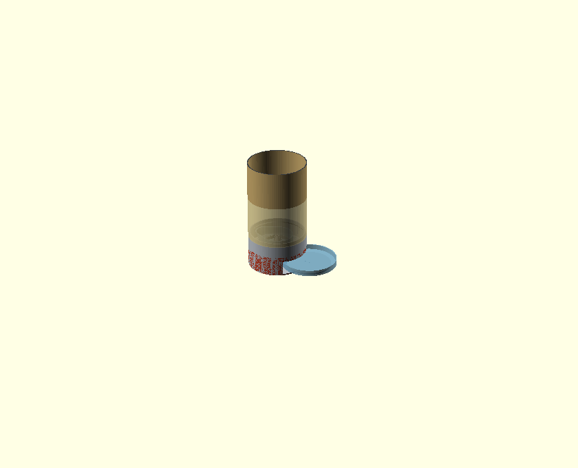 | 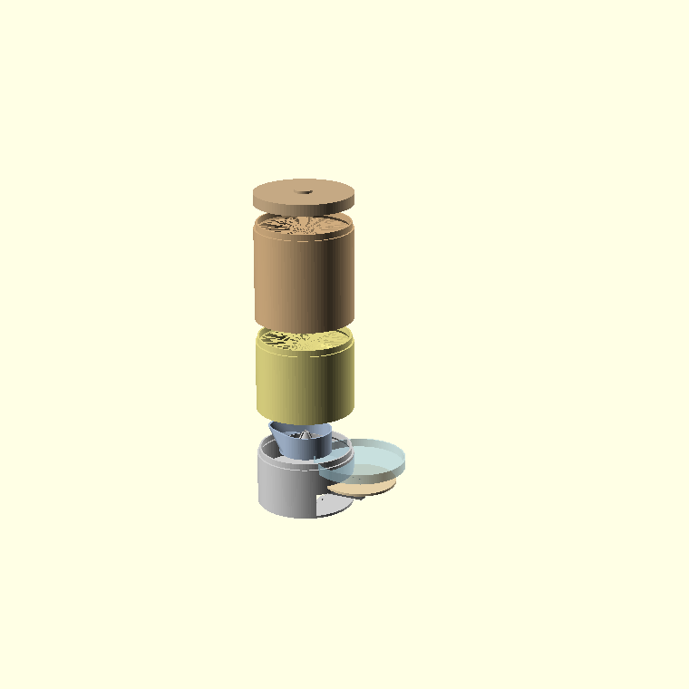 |

| Вибух: база | Вибух: лійка |
|---|---|
| 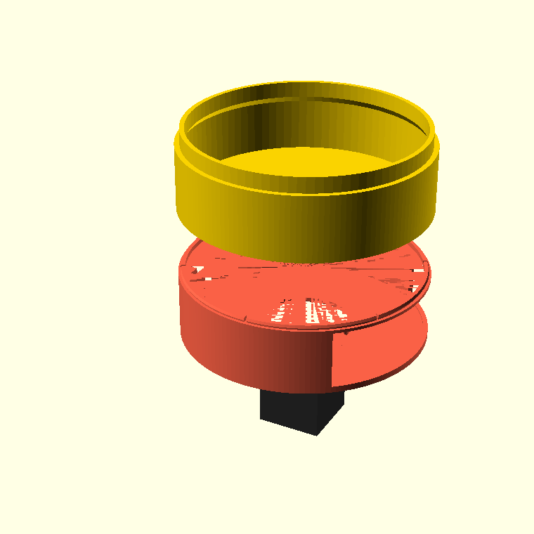 | 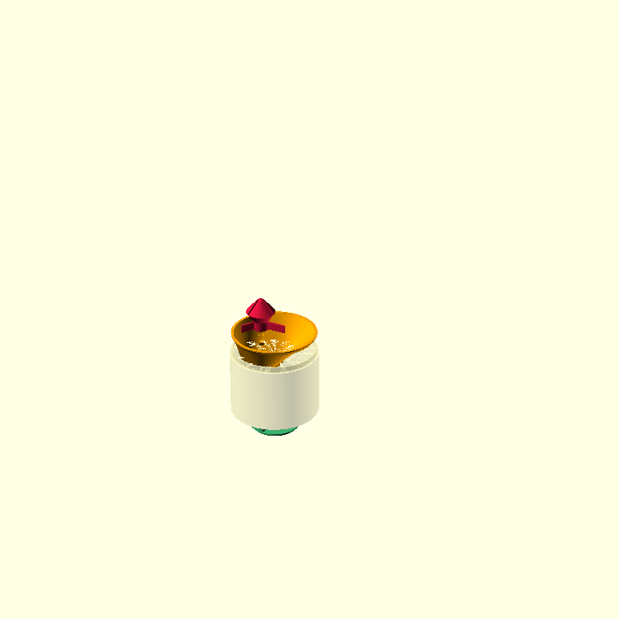 |

### Файли

| Файл | Що |
|---|---|
| `cad/openscad/bulk_hopper_module.scad` | **Головний.** Корпус, лійка, банка, лоток, вага, електроніка |
| `cad/openscad/paddle_wheel_module.scad` | Механізм: `wheel`, `housing`, `axle` |
| `cad/openscad/gallery_views.scad` | Розрізи/галерея (не друкується) |
| `cad/openscad/archive/chassis_module.scad` | **DEPRECATED**, не використовувати |
| `cad/openscad/preview/gallery/` | 41 рендер (кожна деталь + розрізи) |

### Осі та z-площини

```
+X = ПЕРЕД (лоток, виток корму)      -X = ЗАД (сервісна панель, електроніка)
+Z = вгору,  z0 = земля (низ дна)

z0 ─── низ / земля
z3 ──── верх дна (sole_t=3); тут лежить load cell
z4 ──── низ ніші (niche_z0)
z40 ─── верх ніші (niche_h) — стеля скалопа
z43 ─── база деки / низ ДИСКА (base_deck_z) = грань мотора; ВИТОК виходить сюди
z48 ─── верх диска (base_motor_h) = підлога housing
z85 ─── верх бази (base_h) = верх housing; сюди сідає лійка
```

---

## 2. Деталі

### Друковані — 16

| # | part= | Габарит | Друк | Роль |
|---|---|---|---|---|
| 1 | `base_motor` | Ø160 × 46 | стоячи, z0 на стіл | Обичайка: дно, скалоп, пʼєдестал cell, рейки електроніки, сервісне вікно, snap-спігот |
| 2 | `base_hopper` | Ø160 × 52 | диском на стіл | Диск (z43–48) з витоком + комірцем; мотор під ним, housing над ним |
| 3 | `housing` (pw) | Ø88 × 37 | native 0° | Камера дозатора |
| 4 | `wheel` (pw) | Ø80 × 29 | плазом | Колесо, 3 лопаті, **Ø5 D-отвір → прямо на вал** |
| 5 | `axle` (pw) | Ø5 × 70 | стоячи | Опційна верхня вісь |
| 6 | `cap` | 110 × 88 × 14 | плазом | Кришка housing (`cap_plate`) |
| 7 | `shell` | Ø160 × 125 | стоячи | Оболонка лійки |
| 8 | `cone` | Ø153 × 83 | горлом донизу | Mass-flow конус |
| 9 | `spider_body` | Ø52 × 58 | куполом угору | Анти-джам, тіло |
| 10 | `spider_legs` | 3 × (95×60×14) | плазом | Анти-джам, 3 леза |
| 11 | `ring` | Ø160 × 160 | стоячи | Банка, ~2.79 л, стековна |
| 12 | `lid` | Ø160 × 22 | плазом | Верхня кришка |
| 13 | `tray` | Ø150 × 16 | плазом | Лоток-миска, ~280 мл |
| 14 | `cell_platform` | Ø120 × 6 | плазом | Площадка на cell |
| 15 | `el_tray` | 80 × 38 × 9 | плазом, стійками ВГОРУ | Плата-носій електроніки |
| 16 | `el_panel` | 50 × 42 × 4 | стоячи (дай brim) | Сервісна панель, DC-jack + USB |

Габарити зняті з **експортованих STL**, не з памʼяті.

### Галерея деталей

Усі рендери — `cad/openscad/preview/gallery/`, кожна деталь має `*_iso.png` і `*_side.png`.

| `base_motor` — обичайка | `base_hopper` — диск | `housing` — камера |
|---|---|---|
| 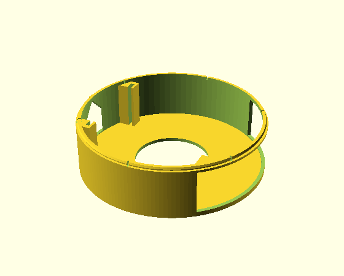 | 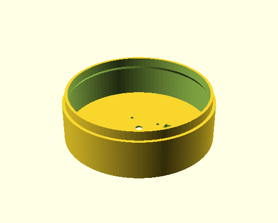 | 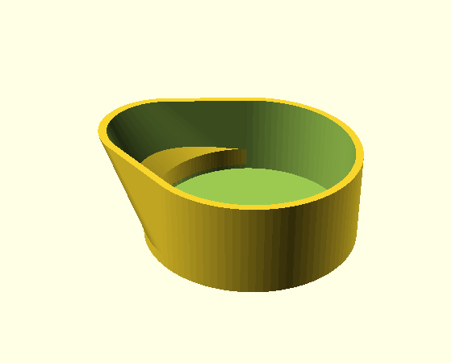 |

| `wheel` — колесо | `cap` — кришка housing | `shell` — оболонка лійки |
|---|---|---|
| 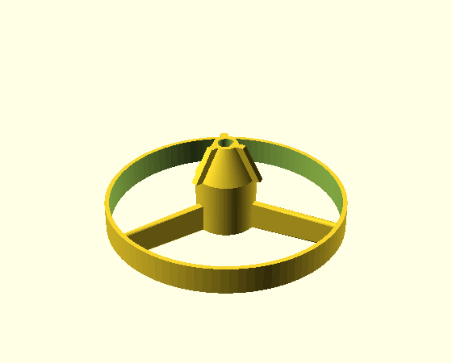 | 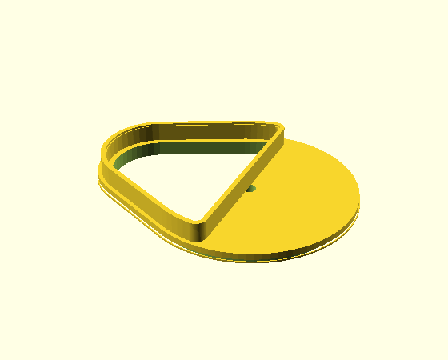 | 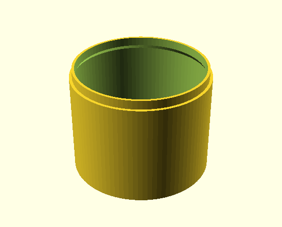 |

| `cone` — конус | `spider_body` — анти-джам | `spider_legs` — леза |
|---|---|---|
| 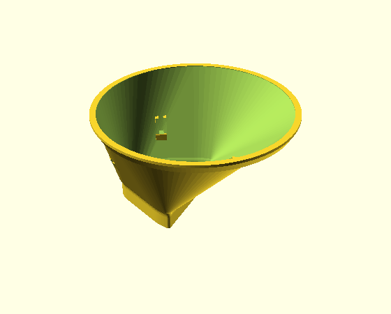 | 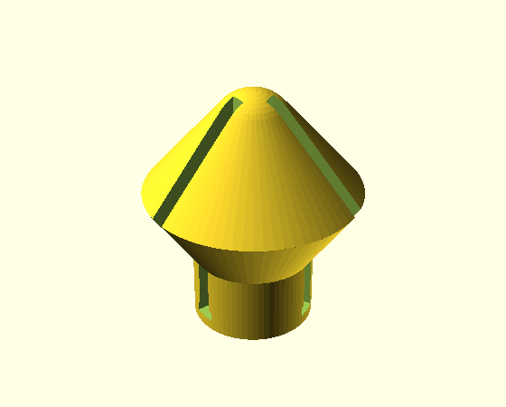 | 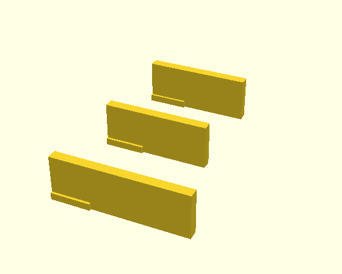 |

| `ring` — банка | `lid` — кришка | `tray` — лоток-миска |
|---|---|---|
| 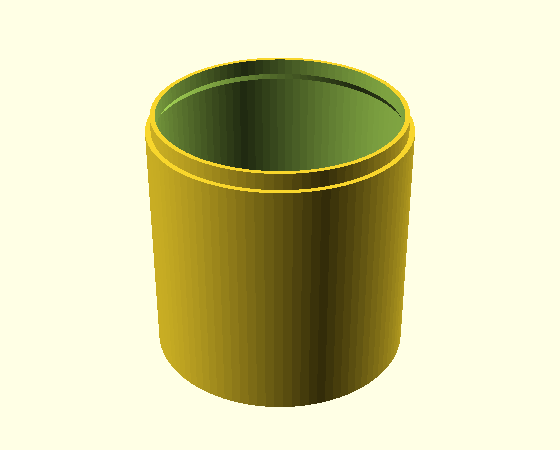 | 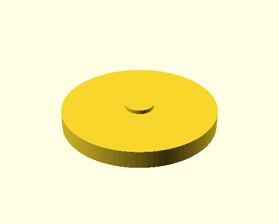 | 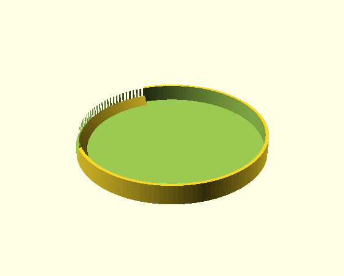 |

| `cell_platform` — площадка ваги | `el_tray` — плата-носій | `el_panel` — сервісна панель |
|---|---|---|
| 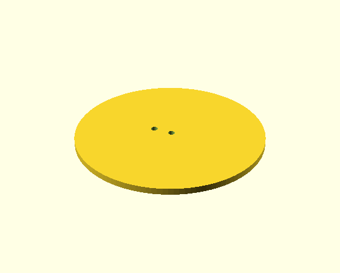 | 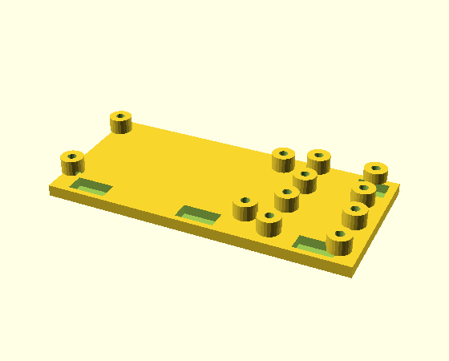 | 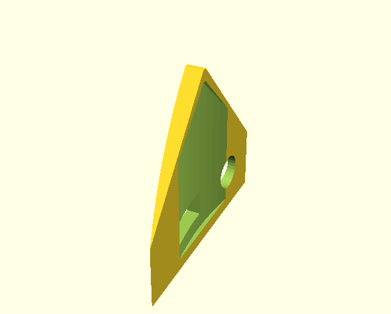 |

### Куплене

NEMA17 17HS4401 (Ø42.3, вал Ø5 D, довж. 40) · load cell 1–5 кг (80×12.7×12.7) ·
HX711 · ESP32 devkit (~52×28) · A4988/DRV8825 · DC-jack Ø8 · USB 12×6 ·
4×M3 (мотор), 4×M4 (cell), M2.5 саморізи (плати).

---

## 3. Як стикується

```
                    lid
                     │  (стиковий замок)
                    ring  ×N
                     │
      spider ──►  shell + cone
                     │   cone: пробка горла → комірець cap_plate
                  cap_plate
                     │   паз знизу ← верхня стінка housing (на 3.5 мм)
                  housing
                     │   виток підлоги ← КОМІРЕЦЬ диска (ключ від прокручування)
   wheel ──────► base_hopper (ДИСК)
   (на вал)          │   snap-спігот + −X ключ
                 base_motor (ОБИЧАЙКА)
                     │
     NEMA17 ─── знизу крізь бор дна, 4×M3 у диск
     el_tray ── згори в 2 вертикальні рейки
     el_panel ─ зсередини у вікно (фланець не дає випасти)
     cell ───── на пʼєдестал (2×M4) → cell_platform (2×M4) → tray зверху
```

### Порядок збирання (жорсткий)

1. **NEMA17 у диск** (`base_hopper`) знизу: пілот у заглиблення, 4×M3.
2. **Колесо на вал** — Ø5 D-отвір, муфти немає.
3. **Housing на диск** — комірець диска входить у виток підлоги = ключ.
4. **Електроніка в обичайку** — `el_tray` згори в рейки, потім `el_panel` у вікно.
5. **Обичайка на диск** — snap клацає, −X ключ ловить орієнтацію.
6. **Вага** — cell на пʼєдестал → `cell_platform` → `tray` зверху.
7. **Кришка + конус** — `cap_plate` на housing, `cone` пробкою в його комірець.
8. **Лійка** — `shell` на верх бази, `spider` усередину конуса.
9. **Банка + кришка** — `ring` ×N, `lid`.

> **Крок 1 має бути ПЕРШИМ.** Щойно обичайка клацне на диск — до гвинтів мотора вже
> не дістатись.

---

## 4. ⚠️ Числа, які не можна чіпати наосліп

Розрізи до кожного пункту (повний набір — `cad/openscad/preview/gallery/sec_*.png`,
відтворюються з `gallery_views.scad`):

| Шлях корму (розріз по Y) | База в розрізі: дно, cell, лоток |
|---|---|
| 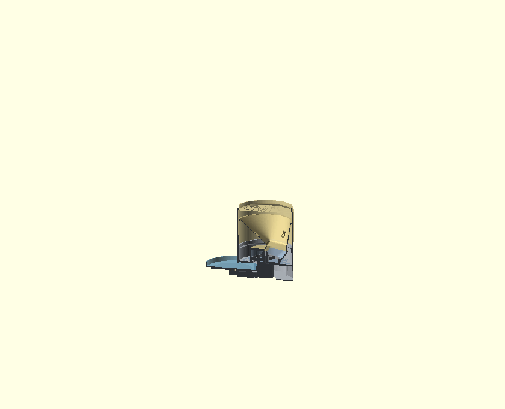 | 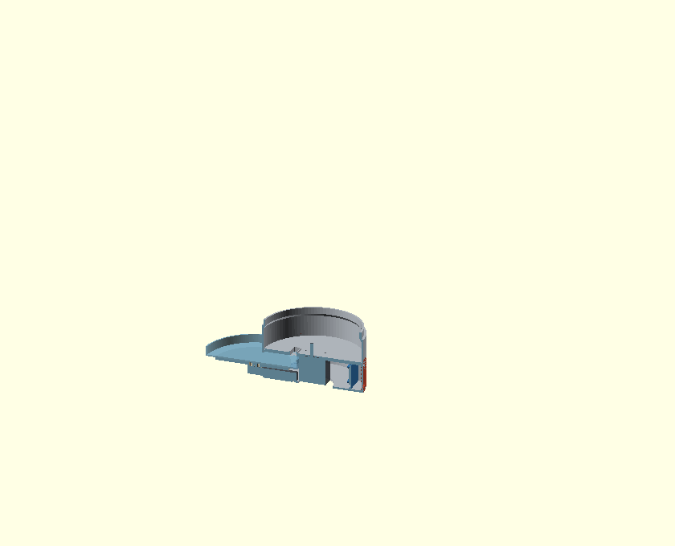 |
| Банка → конус → housing → колесо → виток → комірець → диск → **лоток** | Дно z0–3, cell на пʼєдесталі, площадка, лоток висувається вперед |

| Відсік електроніки — згори (зріз z14–22) | Відсік — збоку |
|---|---|
| 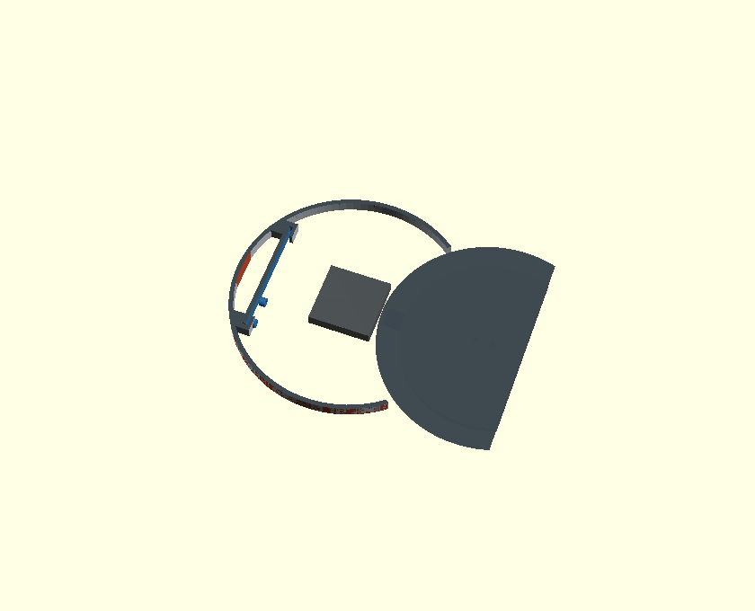 | 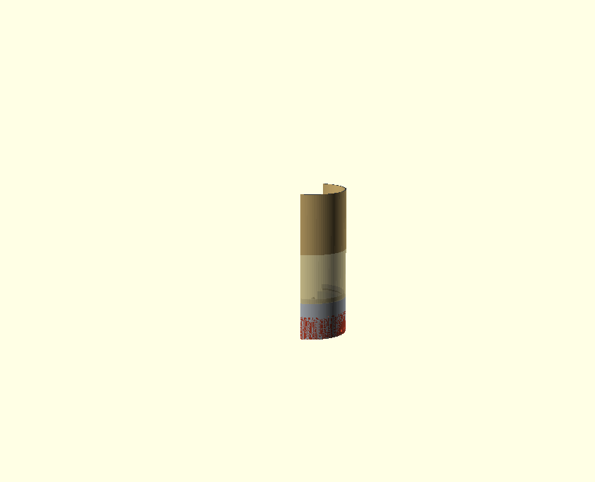 |
| Синє — `el_tray` **ребром** у рейках ззаду; квадрат у центрі — мотор | Плата на всю висоту відсіку (z3–41); червоне — сервісна панель |

### 4.1 Виток корму — затиснутий з ЧОТИРЬОХ боків

`hole_radial_in = 23`, `hole_radial_out = 36`, `hole_w = 34`
(**MUST MATCH в обох файлах** — `bulk_hopper` і `paddle_wheel`).

Найвужче місце тракту — **бор anti-rotation комірця** `ar_bx × ar_by = 10.1 × 31.1`.
Комірець вставляється У виток housing, тому його бор **фізично не може** бути ширшим за
сам виток. Єдиний спосіб розширити — збільшити `hole_len = out − in`.

| Межа | Значення | Запас зараз |
|---|---|---|
| `in` > мотор r21 | 23 | 2.0 |
| `in` > заднього обода лотка | 23 vs x23 | 2.5 (лоток на `bowl_cx=98`) |
| `out` < обода колеса (38.5) | 36 | 2.5 |
| **кут** отвору < `hr_in` 40.8 | 39.2 | **1.6** |

**Кут — це не край.** Отвір прямокутний: `hypot(out−2, hole_w/2−2)+2`.
При `out = 38` кут лягає на **41.0** і **пробиває стінку housing**. Стеля — **37**.

### 4.2 Ніша НЕ СМІЄ доходити до диска

`niche_h = 40`, а диск на z43–48.

Раніше `niche_h` було 58 і `base_niche()` викликалась **і в `base_hopper`** → скалоп
**різав диск наскрізь**: знищував виток, знищував стопорний комірець, і housing стояв
передньою половиною в повітрі. Перерізом підтверджено: диск був суцільний тільки до x≈19.

Зараз `base_hopper` **не викликає** `base_niche()`. Диск = дах ніші.

### 4.3 Відсік електроніки — лише 43 мм заввишки

Мотор висить на всю висоту бази. Тому:
- **плата стоїть РЕБРОМ** (`el_tray` 80×38), а не лежить на поличці;
- горизонтальна полиця в трубі, що друкується стоячи = стеля = **підтримки**;
- усе додане в базу — **вертикальне**: рейки вздовж Z, пази вздовж Z, вікно з **45° gable-дахом**.

Рейки на ±40 мм від осі сектора (`el_sector = 180`, навпроти виходу).
Стійки плати дивляться **до мотора** — там 26 мм, до стінки лише 19.

### 4.4 Лоток — 16 мм, не більше

Бюджет знизу: земля + cell (12.7) + зазор 2 + площадка (4) → підлога лотка **z21.7**.
Лоток мусить **ще й висунутись** під дахом скалопа (z40).

| `tray_h` | обід | висув під дах | падіння корму |
|---|---|---|---|
| 16 | 37.7 | **2.3** ✓ | 5.3 |
| 20 | 41.7 | **−1.7** ✗ | 1.3 |

При 20 мм лоток **не дістати** взагалі.

### 4.5 Синхрон між файлами

`hole_radial_in`, `hole_radial_out`, `hole_w`, `hole_corner_r`, `collar_h`/`cap_collar_h`,
teardrop-набір, `housing_h`/`pw_housing_h2` — **дублюються вручну**. Після зміни звіряй:

```sh
openscad -o /dev/null -D 'part="wheel"' paddle_wheel_module.scad 2>&1 | grep ECHO
# має бути hole=13x34 at r_mid=29.5
```

---

## 5. 🪤 Граблі (на яких я вже наступив)

### OpenSCAD

- **`--render` (CGAL) ІГНОРУЄ `color()`.** Кольорові збірки/розрізи рендеряться тільки
  в preview-режимі (без `--render`).
- **`intersection()` навколо різнокольорового `union()`** — OpenCSG сплющує все в один
  колір. У `gallery_views.scad` кожна деталь ріжеться **окремо** (див. `module piece()`).
- **`include <bulk_hopper_module.scad>` перезаписує `part = "assembly"`** і домальовує
  свою збірку поверх твого виду. Присвой `part = "none"` **ПІСЛЯ** include.
- **Прев'ю бреше про різьбу.** `linear_extrude(twist)` як **додане** тіло рендериться в
  прев'ю, але **зникає на F6/CGAL-експорті**. Завжди перевіряй експортований STL
  перерізом у зоні різьби.

### Слайсер (OrcaSlicer)

- **Глухий різьбовий карман, друкований отвором ВНИЗ, забивається infill** — отвір
  друкується суцільним. Лікується наскрізним бором. (Це вже не актуально — ноги
  видалені — але клас бага той самий для будь-якого глухого кармана.)
- **`center_stl` кладе центр по bbox.** Ніша робить bbox несиметричним, тому центр
  труби в gcode — **(111.4, 95)**, а не (95,95). Рахуй центри отворів через зсув bbox,
  інакше всі заміри падають не туди (я через це двічі «підтвердив» неправильний фікс).

### Метод перевірки, який працює

- Переріз STL → ray-cast → друкувати **прольоти** (spans), а не булеве «solid/void»:
  парність легко ламається на вершинах.
- Перевірка на перетин: `intersection()` двох деталей → експорт STL → **0 трикутників =
  чисто**.
- Слайс і заміри по **gcode**, не по STL: STL може мати отвір, який слайсер закриє.

---

## 6. Що НЕ зроблено

- **Вібромотор** — кріплення відсутнє (причина назви гілки `-vibro`). Опційно: spider
  тримає потік.
- **Отвори під стійки на `el_tray`** — я взяв типові патерни ESP32/A4988/HX711.
  **Звір із реальними платами** перед друком (`esp_holes`, `drv_holes`, `hx_holes`).
- **`shared_params.scad`** — спільні `hole_*`/`collar_h`/teardrop досі дублюються
  вручну в двох файлах. Варто винести.
- **Пʼєдестал cell** підходить до NEMA17 на **1 мм** (x22 vs корпус x21). Перетину
  немає, але допуск тонкий.
- Нічого з цього **не друкувалось у металі** — форма 1a ще не надрукована жодного разу.

---

## 7. Друк / деплой

Скіл `aone2-slice-deploy`: NUC → macmini (OrcaSlicer + профіль `~/Downloads/petFeeder.3mf`)
→ Pi `raspb5` (`~/AONE21_data/gcodes/petFeeder/`).

```sh
# на Mac
python3 pf_make.py <stl> <name>          # слайс + post-process
python3 pf_thumb.py g_<name>/plate_1.gcode <48.png> <300.png>   # thumbnail
```

**STL має бути binary** (`--export-format binstl`) — ASCII не центрується в `pf_make`.

Принцип користувача: **підтримки = сміття = гроші.** Дизайн має бути support-free.

---

## 8. Як перегенерувати картинки

Усі рендери в цьому файлі лежать у `cad/openscad/preview/gallery/`.

```sh
cd hardware/cad/openscad

# одна деталь, 2 ракурси (БЕЗ --render: інакше злетять кольори)
xvfb-run -a openscad -o preview/gallery/tray_iso.png  --imgsize=560,450 \
  --viewall --autocenter --camera=0,0,0,58,0,25,0 -D 'part="tray"' bulk_hopper_module.scad
xvfb-run -a openscad -o preview/gallery/tray_side.png --imgsize=560,450 \
  --viewall --autocenter --camera=0,0,0,90,0,0,0  -D 'part="tray"' bulk_hopper_module.scad

# розрізи (gallery_views.scad): view = product | base | food ; cut = none | slab | xhalf | yhalf
xvfb-run -a openscad -o preview/gallery/sec_food.png --imgsize=840,680 --viewall --autocenter \
  --camera=0,0,0,76,0,195,0 -D 'view="food"' -D 'cut="yhalf"' gallery_views.scad
```

Камера — `--camera=tx,ty,tz,rx,ry,rz,dist`; з `--viewall` дистанція 0 = автопідбір.
`cut="yhalf"` лишає **y<0**, тому щоб бачити площину зрізу, дивись з **+Y** (rz ≈ 180–200).

Візуальний довідник цією ж галереєю (деталі + розрізи + порядок збирання):
<https://claude.ai/code/artifact/f1700034-7984-4b45-b9b1-5870580ef21e>
